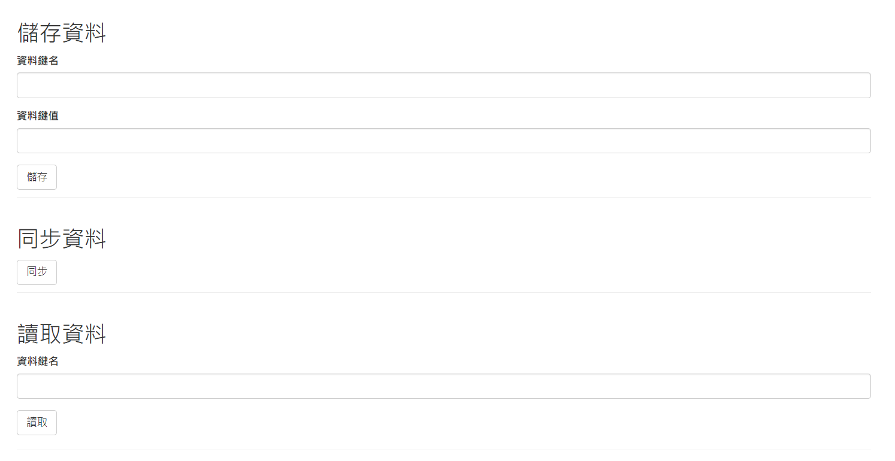

# Docker專業養成：第11章綜合演練練習

主要是建立由 Nginx + Memcached + Mysql + PHP 組成的小專案，最後將這專案製作成Docker compose.yml

與master(amd-64)環境不同，RPi4的memcached、mysql、php-fpm**皆為arm64的image檔案**

- 注意php的lib是限定arm64的php-fpm:5.6下才做編譯(已經編譯好並放在php/exts中)
- php的memcache lib是限定2.2.7版本，並且還得先安裝好zlib
- php的mysql lib則是需要把php-fpm-2.2.7.tar.xz解壓縮

**需注意的是**起好MySql後還需登入並執行以下SQL

|      url     | 帳號 |    密碼    |
|:------------:|:----:|:----------:|
|localhost:3306| root | screencast |

```SQL
CREATE DATABASE web;
USE web;

CREATE TABLE web.ymdot (
    `key` varchar(100) NOT NULL,
    value varchar(100) NULL,
    CONSTRAINT ymdot_PK PRIMARY KEY (`key`)
);
```

最後進入到<http://localhost>，即可看到簡易的網站

